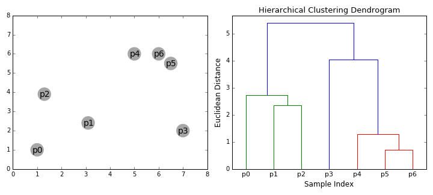

# Package Clustering

##### EL HAJAM Nawel -- YECHCHI Sif-Eddine -- KOUA Richard

##### M2 DATA SCIENCE PARIS SACLAY UNIVERSITY


## Quick Start:

Dans le cadre de notre cours d'algorithmique, nous avons créer notre propre package R/Rcpp intitulé "clustering".
Ce package contient les fonctions suivants : dist.R , Ward.R and hclust.R.

### Package installation:

L'installation de notre package se fait grâce aux commandes suivantes : 


``` r
#devtools::install_github("yechchi/clustering")
library(clustering)
```

## Complexité :


La compléxité temporelle théorique de notre fonction h_clust est de  ***O*(*n*<sup>3</sup>)** .
La solution amélioré de notre fonction a une complexité temporelle de ***O*(*n*<sup>2</sup>log(*n*))** 

## Principes de la CAH : 

L'objectif de la classification ascendante hiérarchique (CAH) est de produire une arborescence qui met en évidence les liens hiérarchiques entre les individus ou entre des groupes d'individus et donc de classer des individus ayant un comportement similaires.
 Regrouper les individus les plus proches nécessite plusieurs conditions :
-  une fonction de distance ;
-  une méthode spécifique de regroupement des individus ;

QUESTION : Comment mesurer la  distance  entre 2 groupes ?

#### Choix d’une distance et d’un critère

Les méthodes de clustering de type hiérarchique sont différentes. Elles forment pas à pas des connexions entre individus (pour les méthodes de clustering hiérarchiques ascendantes), et utilisent une matrice de distances entre individus pour trouver le regroupement le plus proche d’un autre.

En pratique, on part de n ensembles qui sont les individus en tant que singletons. La première connexion se fait donc entre les deux individus les plus proches.

Pour débuter la deuxième étape, il faut mettre à jour la matrice des distances en enlevant une case, à cause du regroupement de deux individus. 
Mais comment calculer la distance d’un ensemble à un autre s’il n’est pas un singleton ? C’est justement un des choix à effectuer au départ : la stratégie d’agrégation. Il y en a de multiples, les plus simples étant de choisir la distance minimale entre les individus des deux groupes (single linkage), maximale (complete linkage) ou bien moyenne (average linkage) ou encore(centroid linkage). (cf. la fonction 'distc')

A la fin de cette deuxième étape, on connecte donc les deux groupes les plus proches. Et ainsi de suite pour les étapes suivantes, jusqu’à connecter les deux derniers groupes qui recouvrent tous les individus.

Les connexions successives se représentent sur un dendrogramme (cf illustration). La distance associée à chaque connexion se trouve sur l’axe y de celui-ci.



L’algorithme se termine bien sûr par le choix de nos clusters. Là encore, le critère n’est pas unique : on peut en vouloir un nombre précis, ou bien fixer un critère de distance inter-classe. On utilise le dendrogramme pour mettre les clusters en évidence.


## Idée pour l'amélioration de la complexité:

La formule de Lance et Williams permet d’unifier plusieurs méthodes
de classification ascendante hiérarchique (CAH). En effet, à l'étape 3, il existe plusieurs techniques de CAH selon la façon dont on définit la dissimilarité entre deux groupes. Cependant, Lance et Williams (Lance et Williams, 1967) ont montré que la majorité d’entre elles pouvaient
être généralisées par la formule suivante: 


Cela nous permet de mettre à jour les formules des distances:


## Simulations:

Nous allons appliquer notre package a un exemple.
Pour ce faire, nous allons commncer par simuler une matrice d'individus :


``` r
matrice<-function(n1,n2){
     a <- matrix (rep(rnorm(n1*n2), n1*n2),n1,  n2)
     return(a)
 }
 
 
 X<-matrice(13,25)
```

Nous allons maintenant appliquer notre fonction de classification a notre matrice X :


``` r
hc(X,6)
```

``` r

Les labels des clusters finaux:
 4 6 6 1 2 5 2 5 3 4 3 6 6 
[[1]]
 [1] 4 6 6 1 2 5 2 5 3 4 3 6 6

[[2]]
[[2]][[1]]
[1] 4

[[2]][[2]]
[1] 5 7

[[2]][[3]]
[1]  9 11

[[2]][[4]]
[1]  1 10

[[2]][[5]]
[1] 6 8

[[2]][[6]]
[1]  2 13  3 12
```

